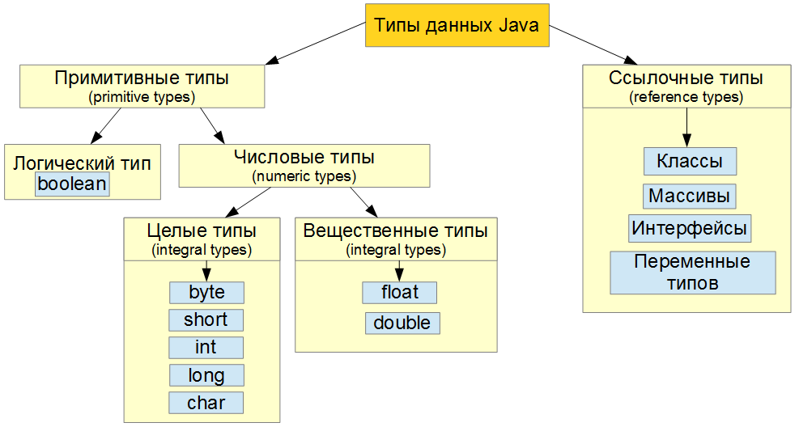
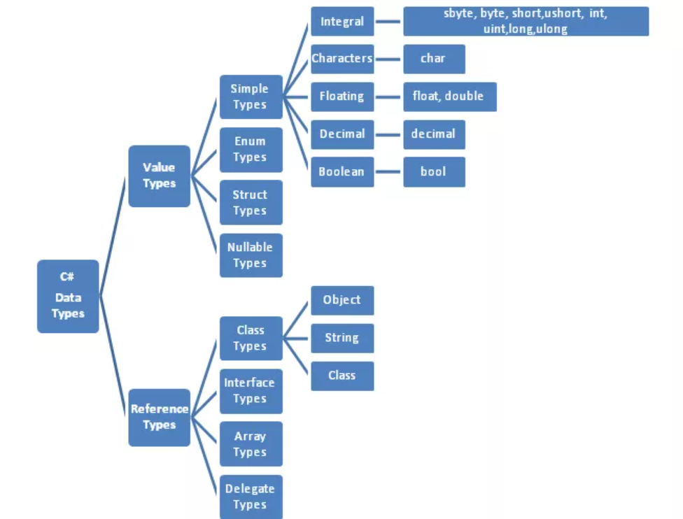

Title: C# vs Java: Система типов
Date: 2023-02-05 21:00
Category: languages
Tags: java, C#
Author: Andrey G
Status: published
Summary: languages, java, jvm, C#, c sharp, .net, dotnet
Lang: ru
---

Наверное, стоит начать знакомство с C# с знакомства с его системой типов и сравнение этой системы с Java ;)


# Как это устроено в Java

Тут все просто.
У нас есть примитивные типы данных (primitive types) и ссылочные типы (reference types).

{: .image-process-article-image}

Главное различие состоит в том, что "primitive types" будут расположены в стеке
а "reference types" это объекты под которые JVM выделит память в heap.

Стоит понимать что для "reference types" в стеке тоже будет выделенно
место - это место под указатель на обект в heap'е.

### Все переменные в Java передаются по значению
Т.е. при передаче в функцию значение
переменной будет скопировано в новое место в стеке. Отсюда следует что присваивание
нового значение формальному параметру функции не изменит переменную за пределами этой функции.

И тут нужно сделать два уточнения:

1. "значение переменной будет скопировано в новое место в стеке" - для "reference types" это означает что
будет скопирован _не сам объект а указатель на него_. Объект за пределами функции и внутри нее будет один.

2. "мы не можем изменить переменную за пределами функции из самой функции" - это справедливо для
"primitive types" и для ссылок от "reference types". Если же мы передали объект класса (reference types) в функция,
то внутри функции мы можем присвоить значение полю этого объекта и это будет то самое изменение данные за пределами функции.

```java
// передача по значению для "primitive types"
class Example {
    public void doSomething() {
        int x1 = 1;
        int x2 = 2;
        int y = computeEquation(x1, x2);

        // тут мы будем иметь
        // x1 == 1
        // x2 == 2
        // y == 44
    }

    private int computeEquation(int argument_x1, int argument_x2) {
        argument_x1 = 42; // тут мы изменим только argument_x1, значение x1 не изменится
        return argument_x1 + argument_x2; // 42 + 2
    }
}
```

```java
// передача по значению для "reference types"
class Example {
    class Point {
        int x1;
        int x2;
        Point(int x1, int x2) {
            this.x1 = x1;
            this.x2 = x2;
        }
    }

    public void doSomething() {
        Point point = new Point(1, 2);
        int x3 = 3;
        int y = computeEquation(point, x3);

        // тут мы будем иметь
        // point.x1 == 42
        // point.x2 == 2
        // x3 = 3;
        // y == 45
    }

    private int computeEquation(Point argument_point, int argument_x3) {
        // argument_point передан по значению. но это "reference types"
        // это значит что подменить "point" в "doSomething" мы не можем
        // а вот поля объекта мы можем поменять
        argument_point.x1 = 42;
        argument_x3 = 1; // а вот это поменяется только в пределах текущей функции
        return argument_point.x1 + argument_point.x2 + argument_x3; // 42 + 2 + 1
    }
}
```

### Autoboxing and Unboxing

Суть здесь в том что примитивные типы расположены в стеке но у джавы есть специальные обертки
для примитивных типов Integer, Double, Boolean etc... и компилятор джавы может делать автоматическое
преобразование "primitive types and their corresponding object wrapper classes".

```java
int x = 7;
Integer wrappedX = x; // примитивный тип будет запакован автоматически
Integer y = 13; // так тоже будет работать

// еще работает при вызове функции
// int computeEquation(Integer argument_x1, int argument_x2)
int x1 = 42;
Integer x2 = 3;
Integer y = computeEquation(x1, x2); // Autoboxing для x1, Unboxing для x2 и Autoboxing для y
```

Никуда без NullPointerException
```java
Integer x1 = new Integer(null);
int x2 = x1; // throws java.lang.NullPointerException
```

### String's

Тема строк может быть отдельной большой темой но пару слов про них сказать необходимо.

Строка в Java - __неизменяемый объект__. Если вам нужно склеить две строки или удалить подстроку
то результатом будет уже новая строка.

Java может хранить строки в двух обсластях памяти

1. string pool - это специальная обсласть памяти отведенная для хранения объектов строк. Имеет следующие особенности:

- Экономит память используя один объект в разных частях программы. Если "привет вам" используется несколько раз
то будет "подставлен" использован один и тот же объект. Это безопасно так как строки неизменяемы
- Эту обсласть памяти обрабатывает сборщик мусора (так было не всегда)
- Все строки попадут в string pool кроме тех что созданы с `new String`
- Можно поместить строку в string pool принудительно `String myStr = "hello!!!".intern();`

2. строки в куче - это:

- строки созданные с `new String`
- для двух одинаковых строк `String s1 = new String("привет вам");` и `String s2 = new String("привет вам");`
будут созданы разные объекты в heap

Все эта история с string pool по задумке должна экономить память но нужно быть аккуратным при его использовании
через intern так как это может повлиять на производительность.

### Массивы

Массимы "primitive types" и "reference types" Java хранит в heap.

```java
int[] x = new int[] { 1, 2, 3, 4 }
// не смотря на то что int - это примитивный тип
// сам массив int[] - это объект в памяти heap

Integer[] x = new Integer[] { 1, 2, 3 };
String[] str = new String[]{"str1", "str2", "str3"};
MyObject[] myArray = new MyObject[42]; // такие массы тоже попадают в heap
```

Мы не можем поменять размер уже созданного массива.
Если нам нужно больше места то создаем новый массив и копируем в него все из старого.

Максимальный арзмер массива - Integer.MAX_VALUE

### Java Records

```java
record Rectangle(double length, double width) { }
```

По большому счету - это [синтаксический сахар над классами](https://docs.oracle.com/en/java/javase/17/language/records.html).
Record - это новый тип класса для которого будут автоматически сгенерированны hashCode, equals, toString,
он может иметь конструктор и в плане хранения в памяти он все тот же (reference type) class
с некоторыми ограничениями на наследование.

### Автоматическое определение типа переменной

Компилятор может сам вывести тип переменной. Для этого можно определить тип переменной как var

```csharp
var limit = 3; // получим int limit
```


# А теперь про C#

В C# значение любого типа можно рассматривать как объект.

Рассмотрим классификацию типов в C# на рисунке ниже. Тут много общего с Java.

{: .image-process-article-image}

Аналогично Java, все типы делятся на два типа

- "reference type" - как и в Java. Ссылки, указывающие на объекты в куче
- "value type" - по своей сути - это все те же примитивные типы "primitive types" из Java
но в C# эти типы более функциональные

Рассмотрим чуть подробнее оба типа

### reference types

Все просто, объект (class, record, delegate, массив или interface) лежит в куче а в переменной на стеке у нас указатель на объект. Все как в Java.
Есть мнение ([с аргументами](https://github.com/dotnet/coreclr/pull/20814)), что это не всегда так.

```csharp
MyClass mcls = new MyClass();
```

NOTE: Ключевое слово для `System.Object` - `object`

### value types

Идея похожа на Java. Если у нас есть простые (примитивные типы) размер которых мы знаем, то мы можем разместить их в стеке.
В C# таких "простых" объектов больше чем в Java, например структуры.

Часть из Value Types похожая на Java систему типов - это Simple Types. Integer, Boolean, etc...
Но здесь тоже есть различия. в (! Integer & int )

```csharp
int x = 13;
bool flag = false;

enum MyTypes
{
    First,
    Second
}
MyTypes type = MyTypes.First;
```

NOTE: Все типы в C# являются производными от `System.Object`.
Даже `int`, который является ключевым словом для `System.Int32`.
А `System.Int32` в конечном счете являются производными от базового типа `System.Object`.

#### Boxing and Unboxing

[Boxing](https://learn.microsoft.com/en-us/dotnet/csharp/programming-guide/types/boxing-and-unboxing)
- преобразование "value types" в объект "reference types".
Преобразование в тип object или в любой другой тип интерфейса, реализуемый этим типом значения.

[Unboxing](https://learn.microsoft.com/en-us/dotnet/csharp/programming-guide/types/boxing-and-unboxing)
- преобразрвание объекта "reference types" в "value types". Явное преобразованием из типа object в тип значение.
При распаковке выполняется проверка типа и копирование значения.

В целом - это оцень похоже на Autoboxing и Unboxing в Java.

```csharp
object value1 = 7; // boxing

int x = 3;
object x1 = x; // boxing

int result = (int) x1; // unboxing
```

Boxing (unboxing в меньшей степени) влияет на производительность так как тербует нового объекта в куче для хранения значения.

Может порождать следующие исключения:

1. `NullReferenceException` - при попытке распокавать null

2. `InvalidCastException` - если типы не совместимы

NOTE: Структуры в C# могут реализовывать интерфейсы. При приведении структуры к такому интерфейсу - структура буте упакована (Boxing).

NOTE: приведение `struct` к `object` типу приведет к Boxing этой структуры. Гарантия остаться в стеке - ref struct.


### Nullable Types
Отдельно стоит поговорить про [Nullable Types](https://learn.microsoft.com/ru-ru/dotnet/csharp/language-reference/builtin-types/nullable-value-types#examination-of-an-instance-of-a-nullable-value-type).

Обычные "Value Type" такие как int, double, bool не могут принимать значение null.
Ho! :) если очень хочется то мы можем использовать такую конструкцию: System.Nullable<T> или T?

```csharp
int? someValue = 42; // представляет все значения базового типа T и дополнительное значение NULL
bool? flag = false; // можно присвоить true, false или null
Nullable<double> = 3.14;
    ```

##### для элементов массива
```csharp
int?[] arr = new int?[10];
arr[0] = 3;
arr[1] = 13;
arr[2] = null;
arr[3] = 42;
```

##### проверка типа/значения
```csharp
int? a = 42;

a.HasValue; // == true, false for null value

a != null; // true, false for a = null
```

__Nullable<T>.Value__ - выкидывает исключение InvalidOperationException если HasValue возвращает false

##### Приведение Nullable Types к Value Type

```csharp
int? x = 42;

int x1 = x ?? -1; // -1 будет использоватсья если x is null

int x2 = x.GetValueOrDefault(-1); // Nullable<T>.GetValueOrDefault()

int x3 = (int)x; // будет работать но выкидывает InvalidOperationException если x is null
```

__операторы__ возвращают null если один о операндов is null
```csharp
int? a = 10;
int? b = null;
int? c = 10;

a++;        // a is 11
a = a * c;  // a is 110
a = a + b;  // a is null
```

Nullable Types могут быть упакованы Boxing & Unboxing по следующим правилам

- если HasValue is true - будет упаковано значение примитивного типа
- если HasValue is false - создается пустая ссылка


### Передача аргументов

По умолчанию, как и в Java, аргументы передаются по значению. Это значит что для примитивного
типа будет скопировано его значение а для ссылки на объект - будет скопирована ссылка.

Но в C# доступна возможность передавать параметры по ссылке.

Следующие модификаторы инициируют передачу параметров в функцию по ссылке

__ref__ - передает параметр по ссылке. Переменная должна быть инициализирована до передачи.
Может быть изменена внутри метода.
нельзя использовать в первом аргументе метода расширения

__out__ - передает параметр по ссылке. Внутри функции должна быть инициализация переменной.
нельзя использовать в первом аргументе метода расширения

__in__ - передает параметр по ссылке НО гарантирует, что аргумент не будет изменен.
нельзя использовать, если только первый аргумент не является структурой

NOTE: _in, ref и out не считаются частью сигнатуры метода_

NOTE: in, ref и out нельзя использовать для асинхронные методы, методы итератора

__возвращаемые ссылочные значения__ - вот еще одна странная штука из C#. Мы можем изметода вернуть объет по ссылке.

```csharp
public ref int getValue() {
    int value = 7;
    return ref value;
}
```

NOTE: res readonly - запрещается изменять значение

__ссылочные локальные переменные__ - задает ссылку на значения, возвращаемые с помощью return ref.

```csharp
ref int value = ref MyClass.getValue();
```

### struct & enum
В C# существуют (Value Type) типы Struct Type и Enum Type, которые представляет из себя пользовательские типы данных и размещаются в стеке.

Как аналог для "Struct Type" из мира Java можно привести Java Records, но они просто подвид класса и являются "reference type".

Enum Types - в Java - это тоже "reference type" и хранится в куче.

Если структура объявлена как поле в классе то структура будет размещена в heap а не в стек.

### Struct

[Структура](https://learn.microsoft.com/en-us/dotnet/csharp/language-reference/builtin-types/struct) - это "value type".
При создании структуры переменная, которой присвоена структура, содержит фактические данные этой структуры.
Если структура присваивается новой переменной, все данные копируются.

```csharp
public struct Point
{
    public Point(double x, double y)
    {
        X = x;
        Y = y;
    }

    public double X { get; }
    public double Y { get; }

    public override string ToString() {
        return $"({X}, {Y})";
    }
}
```
Как правило, структурные типы используем в приложениях ориентированных на данные.
В приложениях ориентированных на поведение мы используем классы.

__readonly__ структуры не могут быть модифицированы и обязывают иметь все поля структуры как readonly или с init сеттером
```csharp
public readonly struct Point
{
    public Point(double x, double y)
    {
        X = x;
        Y = y;
    }

    public double X { get; init; }
    public double Y { get; init; }

    public override string ToString() {
        return $"({X}, {Y})";
    }
}
```

NOTE: Чтобы использовать все преимущества записей Records мы можем использовать `record struct` и `readonly record struct`.

NOTE: Параметры по умолчанию для структур можно организовать с помошью конструктора без параметров.

NOTE: Чтобы передать структуру по указателю можно использовать ref, out, in, ref returns.

[ref structure types](https://learn.microsoft.com/en-us/dotnet/csharp/language-reference/builtin-types/ref-struct)<br />
no-heap guarantee. Экземпляры структуры объявленной как `ref struct` не могут быть размещены в куче и всегда размещаются в стеке.

ref struct - не может быть полем класса, параметрам async метода, cast to object.


### Enum

[Перечисление](https://learn.microsoft.com/en-us/dotnet/csharp/language-reference/builtin-types/enum) определяет
_набор именованных целочисленных констант_. Enum - это "value type".

```csharp
enum Ttt // be default - int, начинается с 0
{
    Aaa,
    Bbb,
    Ccc
}

enum Ttt : ushort // adjusted type
{
    Aaa = 0,
    Bbb = 1,
    Ccc = 3
}
```

#### Enum with bitmask

Флаги могут быть объеденены с помощью побитовых операций | или &

```csharp
[Flags]
public enum Days
{
    None      = 0b_0000_0000,  // 0
    Monday    = 0b_0000_0001,  // 1
    Tuesday   = 0b_0000_0010,  // 2
    Wednesday = 0b_0000_0100,  // 4
    Thursday  = 0b_0000_1000,  // 8
    Friday    = 0b_0001_0000,  // 16
    Saturday  = 0b_0010_0000,  // 32
    Sunday    = 0b_0100_0000,  // 64
    Weekend   = Saturday | Sunday
}

Days meetingDays = Days.Monday | Days.Wednesday | Days.Friday;
```

Примеры как использовать
```csharp
public enum ABC
{
    A,
    B,
    C
}

Console.WriteLine($"{WABC.A} = {(int)WABC.A}"); // "A = 0"

var x = (ABC)1;
Console.WriteLine($"{x} = {(int)x}"); // "B = 1"

var y = (ABC)42; // out of scope
Console.WriteLine($"{y} = {(int)y}"); // "42 = 42", it works
```


### String's

```csharp
public sealed class String : ICloneable, IComparable, IComparable<string>,
    IConvertible, IEquatable<string>, System.Collections.Generic.IEnumerable<char>
```

Строка (reference type) — это последовательная коллекция символов System.Char (UTF-16).
Максимальный String размер объекта в памяти составляет 2 ГБ, или около 1 миллиарда символов.

```csharp
string mystr = "Example string.";

string filePath1 = "C:\\Data\\File.ext";
string filePath2 = @"C:\Data\File.ext"; // @ - экранирование "\"

char[] chars = { 'w', 'o', 'r', 'd' };
string mystr = new string(chars);
```

NOTE: Оператор == для строк представляют свою реализацию, отличную от стандартной для всех других объектов ссылочного типа.
Если сравниваемые ссылки имеют тип System.String, то он сначала сравнит указывают ли ссылки на один тот же объект и если нет,
то будет сравнивать две ссылки типа System.String по значению.

#### интерполяция строк

Специальный знак $ идентифицирует строковый литерал как интерполированную строку.

```csharp
int a = 1;
int b = 2;
string result = $"a = {a}; b = {b}";
string result2 = $"""a = "{a}"; b = "{b}";""";

// or, with paddings
Console.WriteLine($"|{"Left",-7}|{"Right",7}|");
```

#### интернирование строк

C# (как и string pool в Java) помещает строки доступные компилятору в пул. Строки созданные с new создаются в куче и имеют разные указатели.

В runtime мы можем получить указатель на подобнуй строку через String.Intern(string). Также есть признак интернирования String.IsInterned(string).

```csharp
string a = "hello";
string b = new string(new char[] { 'h', 'e', 'l', 'l', 'o' });
string c = String.Intern(b);

(Object)a == (Object)b; // false
(Object)a == (Object)c; // true
```


### Записи. Records

Records - предоставляет встроенную функциональность для инкапсуляции данных. Generate: Equals, HashCode, ToString.
Типы записей могут быть либо ссылочными типами (record class), либо типами значений (record struct).

Java Records - прямой аналог для C# Records.

1. `record class` - "reference type"

```csharp
// Ex1
public record Person(string FirstName, string LastName);

// Ex2, запись с неизменяемыми полями
public record Person
{
    public string FirstName { get; init; } = default!;
    public string LastName { get; init; } = default!;
};

// Ex3, запись с изменяемыми полями
public record Person
{
    public string FirstName { get; set; } = default!;
    public string LastName { get; set; } = default!;
};
```

2. `record struct` - with same as for `record class` functionality - "value type"

```csharp
// Ex1
public readonly record struct Point(double X, double Y, double Z);

// Ex2, запись с неизменяемыми полями
public record struct Point
{
    public double X {  get; init; }
    public double Y {  get; init; }
    public double Z {  get; init; }
}

// Ex3, запись с изменяемыми полями
public record struct Point
{
    public double X { get; set; }
    public double Y { get; set; }
    public double Z { get; set; }
}
```

__Positional syntax for property definition__

```csharp
public record Person(string FirstName, string LastName);

public static void Main()
{
    Person person = new("Nancy", "Davolio");
    Console.WriteLine(person);
    // output: Person { FirstName = Nancy, LastName = Davolio }
}
```

__Наследование__

```csharp
public abstract record Person(string FirstName, string LastName);
public record Teacher(string FirstName, string LastName, int Grade) : Person(FirstName, LastName);

public static void Main()
{
    Person teacher = new Teacher("Nancy", "Davolio", 3);
    Console.WriteLine(teacher);
    // output: Teacher { FirstName = Nancy, LastName = Davolio, Grade = 3 }
}
```

__Deconstructor__

```csharp
public abstract record Person(string FirstName, string LastName);
public record Teacher(string FirstName, string LastName, int Grade): Person(FirstName, LastName);

Person teacher = new Teacher("Nancy", "Davolio", 3);
var (fName, lName, grade) = (Teacher)teacher;
```

### Неявные типы. Автоматическое определение типа переменной

Компилятор может сам вывести тип переменной. Для этого можно определить тип переменной как var

```csharp
var limit = 3; // получим int limit
```

### Aнонимные типы

Когда нет смысла создавать отдельный тип. Generated: ToString, Equals, GetHashCode.

```csharp
var v = new { Amount = 108, Message = "Hello" };
Console.WriteLine(v.Amount + v.Message);

// or, in LINQ
var productQuery =
        from prod in products
        select new { prod.Color, prod.Price };

// or, for array's
var anonArray = new[] { new { name = "apple", diam = 4 }, new { name = "grape", diam = 1 }};
```

Анонимные типы — это class типы, которые являются производными непосредственно от object типа, и их нельзя привести к любому типу, кроме object.

### Тип времени компиляции и тип времени выполнения

Переменная может иметь разные типы времени компиляции и времени выполнения.
Тип времени компиляции является объявленным или выведенным типом переменной в исходном коде.
Тип времени выполнения является типом экземпляра, на который ссылается такая переменная.

```csharp
object anotherMessage = "This is another string of characters";
IEnumerable<char> someCharacters = "abcdefghijklmnopqrstuvwxyz";
```

В обоих предыдущих примерах используется тип времени выполнения string.
Тип времени компиляции в первой строке — object, а во второй — IEnumerable<char>.


# Можно почитать

[Система типов C#](https://learn.microsoft.com/ru-ru/dotnet/csharp/fundamentals/types/)

[String Класс](https://learn.microsoft.com/ru-ru/dotnet/api/system.string?view=net-7.0)

[The Java® Language Specification](https://docs.oracle.com/javase/specs/jls/se11/html/index.html)

[интересная статья с хабра: "Популярные заблуждения о C#"](https://habr.com/ru/post/541786/)

[Все о String.intern()](https://habr.com/ru/post/79913/)

[Особенности строк в .NET](https://habr.com/ru/post/172627/)

[Руководство по String pool в Java](https://topjava.ru/blog/rukovodstvo-po-string-pool-v-java#6)
