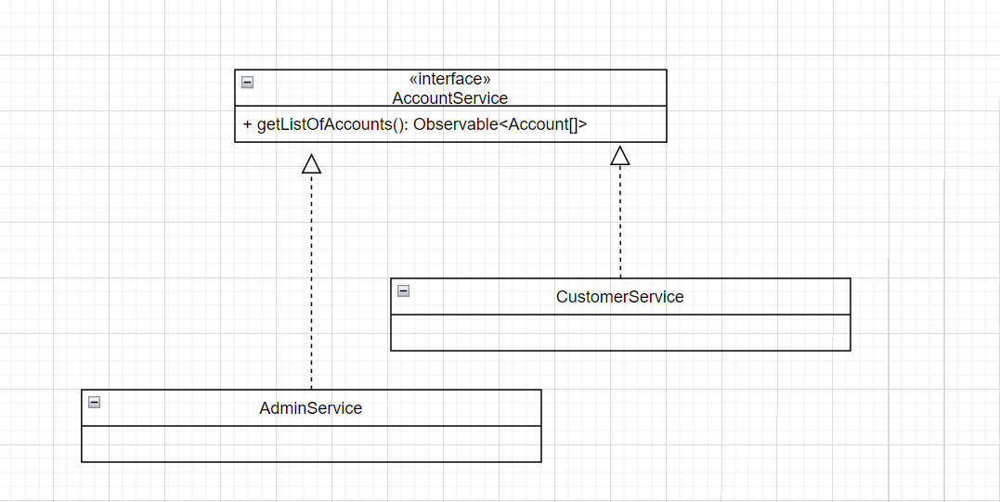

Title: Several service implementations in Angular
Date: 2022-03-05 21:00
Category: Angular
Tags: angular, service
Author: Andrey G
Status: published
Summary: Several service implementations in Angular
Lang: en
---

{: .image-process-article-image}

**The idea**: I would like to have ability to write code like I do this in Java ;). I would like to have ability to create a code with abstract service and provide different implementation for different components.

demo application: [https://github.com/AGanyushkin/demo-angular-multiple-service-implementation](https://github.com/AGanyushkin/demo-angular-multiple-service-implementation)

# Why I can’t just write a code?

Because it is not possible to have simple implementation of this due to interfaces in javascript is not available in runtime. It can be achieved with additional identifiers for interface and services and support from framework or platform.

# How I can implement it with Angular?

We have DI in Angular and it provides for as the chance to configure DI provider to inject required service for our components or other services.

Entities here to use with with our abstract code

```typescript
export interface Account {
  id: string
  name: string
}

export interface AdminAccount extends Account {
}

export interface CustomerAccount extends Account {
}
```

**First step**: create interface and implements as a services

```typescript
export interface AccountService {
  getListOfAccounts(): Observable<Account[]>
}

@Injectable()
export class CustomerService implements AccountService {
    constructor() { }

    getListOfAccounts(): Observable<CustomerAccount[]> {
        return ...
}

@Injectable()
export class AdminService implements AccountService {
    constructor() { }

    getListOfAccounts(): Observable<AdminAccount[]> {
    return ...
}
```

**Second step**: in shared code we can use only interface without specific implementation.

For example, we can inject service by interface and get account stream from it

##### AccountListViewComponent
```typescript
@Component({
  ...
})
export class AccountListViewComponent implements OnInit {
  accounts$: Observable<Account[]> | null = null

  constructor(@Inject("accountService") private accountService: AccountService) { }

  ngOnInit(): void {
    this.accounts$ = this.accountService.getListOfAccounts()
  }
}
```

but we need to use service injection with annotasion to specify service qualifier name

```typescript
@Inject("accountService") private accountService: AccountService
```

**Third step**: In our last step we just need to provide right service

in module level, we can provide service for the module
```typescript
@NgModule({
  ...
  imports: [
      CommonModule,
      AccountModule
  ],

  providers: [
    { provide: 'accountService', useClass: AdminService }
  ]
})
export class AdminModule { }
```

or we can provide service implementation in component level

```typescript
@Component({
  ...
  providers: [
    { provide: 'accountService', useClass: CustomerService }
  ]
})
export class CustomerListViewComponent implements OnInit {
  ...
```

# Conclusion

I like this ability. It interrupts me less when I need to switch between UI and Backend projects.
