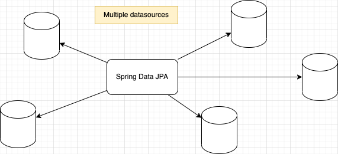
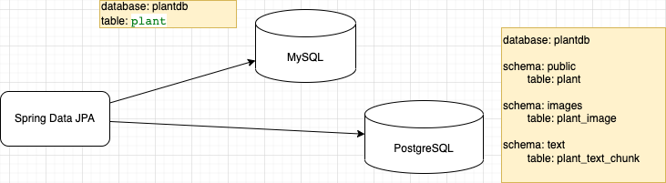
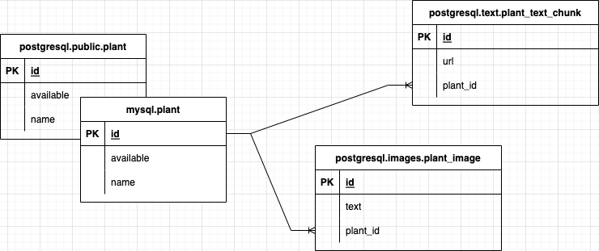

Title: Multiple datasources in Spring Data JPA application
Date: 2022-03-19 21:00
Category: Spring
Tags: mysql, postgresql, spring boot, spring data jpa
Author: Andrey G
Status: published
Summary: Multiple datasources in Spring Data JPA application
Lang: en
---

[TOC]

{: .image-process-article-image}

I would like to design data layer for my project and I have a problem to use different datasources in one application.

Multiple datasources in one application – it is not a problem for Spring Data JPA.

All code you can find here: [https://github.com/AGanyushkin/springdatajpa-multiple-datasources](https://github.com/AGanyushkin/springdatajpa-multiple-datasources)

# Let’s try 🙂

I will be experiment with access to different datasources like described below:

{: .image-process-article-image}

Out data schema look like this:

{: .image-process-article-image}

Data are located in two different databases PostgreSQL and MySQL. There are tree different tables in free different schemas (public,images,text) inside PostgreSQL database instance.

To make it a bit difficult we try to implement similar tables in both MySQL & PostgreSQL instances. As result it will be great to have only one entity definition for this table in our code.

In this experiment I would like to use `plant` table from MySQL database but related tables `plant_image` and `plant_text_chink` from PostgreSQL database. I mean what I can’t use join between related tables, but I can use relations through hibernate and for me as for developer it seems like one datasources with set of repositories.

# How it can be implemented?

The main idea for multiple datasource implementation is very simple:

- Initialize `EnableJpaRepository` for each database
- In scope of `EnableJpaRepository` annotation we can define package(s) which contains our repositories, entity manager and transaction manager.

```java
@EnableJpaRepositories(
        basePackages = "pro.ganyushkin.springdatajpamultipleds.repository.mysql",
        entityManagerFactoryRef = "mysqlEntityManager",
        transactionManagerRef = "mysqlTransactionManager"
)
...
```

- Create datasource for each database. Each datasource will be associated with properties from `application.yaml` through `@ConfigurationProperties` annotation

```java
@Bean(name = "mysqlDataSource")
@ConfigurationProperties(prefix = "datasource.mysql")
public DataSource mysqlDataSource() {
    return DataSourceBuilder.create().build();
}
```

- For each datasource we need to define its own entity manager & transaction manager

Different schemas for PostgreSQL will be implemented through `schema` property in `@Table` annotation.

```java
@Entity
@Table(name = "plant_image", schema = "images")
public class PlantImageEntry {
    ...
```

# Implementation

That’s all, let’s implement all that was described above for one datasource as configuration for this datasource.

```java
@Configuration
@EnableJpaRepositories(
        basePackages = "pro.ganyushkin.springdatajpamultipleds.repository.pg",
        entityManagerFactoryRef = "pgEntityManager",
        transactionManagerRef = "pgTransactionManager"
)
@EnableTransactionManagement
public class PostgreSQLConfiguration {

        @Bean(name = "pgDataSource")
        @Primary
        @ConfigurationProperties(prefix = "datasource.pg")
        public DataSource pgDataSource() {
                return DataSourceBuilder.create().build();
        }

        @Bean(name = "pgEntityManager")
        @Primary
        public LocalContainerEntityManagerFactoryBean pgEntityManager(
                @Qualifier("pgDataSource") DataSource plantsDataSource) {
                var em = new LocalContainerEntityManagerFactoryBean();
                em.setDataSource(plantsDataSource);
                em.setPackagesToScan(
                        "pro.ganyushkin.springdatajpamultipleds.entity.shared",
                        "pro.ganyushkin.springdatajpamultipleds.entity.pg"
                );
                var vendorAdapter = new HibernateJpaVendorAdapter();
                em.setJpaVendorAdapter(vendorAdapter);
                HashMap<String, Object> properties = new HashMap<>();
                properties.put("hibernate.hbm2ddl.auto", "validate");
                properties.put("hibernate.dialect", "org.hibernate.dialect.PostgreSQLDialect");
                em.setJpaPropertyMap(properties);
                return em;
        }

        @Bean
        @Primary
        public PlatformTransactionManager pgTransactionManager(
                @Qualifier("pgEntityManager") LocalContainerEntityManagerFactoryBean plantsEntityManager) {
                var transactionManager = new JpaTransactionManager();
                transactionManager.setEntityManagerFactory(plantsEntityManager.getObject());
                return transactionManager;
        }
}
```

of course it is important to mark one data source as `@Primary`

Repository example

```java
@Repository
public interface PgTextChunkRepository extends CrudRepository<TextChunkEntry, UUID> {
    List<TextChunkEntry> findAllByPlant(PlantEntry plant);
    Optional<TextChunkEntry> findFirstByPlant(PlantEntry plant);
}
```

Entity example

```java
@Data
@AllArgsConstructor
@NoArgsConstructor
@Entity
@Table(name = "plant_text_chunk", schema = "text")
public class TextChunkEntry {

    @Id
    @Type(type="uuid-char")
    private UUID id;

    @Column(columnDefinition = "TEXT")
    private String text;

    @ManyToOne
    private PlantEntry plant;
}
```

here we can see approach how we can split entities in different `schemas schema = "text"`

# Shared entity

In out implementation `PlantEntry` – it is entity which shared between PostgreSQL & MySQL.

```java
@Data
@AllArgsConstructor
@NoArgsConstructor
@Entity
@Table(name = "plant")
public class PlantEntry {

    @Id
    @Type(type="uuid-char")
    private UUID id;

    @Column
    private String name;

    @Column
    private Boolean available;
}
```

But for us it is simple to use this entity as description for tables in both databases and as related entity for `TextChunkEntry` and `PlantImageEntry`

```java
...
@Entity
@Table(name = "plant_image", schema = "images")
public class PlantImageEntry {
    ...

    @ManyToOne
    private PlantEntry plant;
}
```

In service implementation it look pretty simple to use entities from different databases

```java
@Transactional(readOnly = true)
public List<TextResponse> findAllTextEntries(UUID plantId) {
    return pgTextChunkRepository
                .findAllByPlant(
                        mySQLPlantRepository
                            .findByAvailableIsTrueAndId(plantId)
                            .orElseThrow()
                ).stream()
                .map(entry -> new TextResponse(entry.getId()))
                .toList();
}
```

# Touch the demo

There is some tests which we can try in file here `src/test/resources/content.rest`

```text
http://localhost:8080/api/v1/content/plant/824f1857-c36c-4340-9f67-ad4c0ea87757/image

HTTP/1.1 200
Content-Type: application/json;charset=utf-8
Transfer-Encoding: chunked
Date: Mon, 01 Aug 2022 13:15:18 GMT
Keep-Alive: timeout=60
Connection: keep-alive

[
  {
    "id": "6ce94d62-efb9-4afe-ae49-c56da44f4ee9",
    "url": "http://bla.bla/bla"
  },
  {
    "id": "ee8f7d28-4e17-441c-9963-e9399690c0d7",
    "url": "http://bla.bla/bla/2"
  }
]
```

# Problems

- Sometimes if you are using databases from different vendors MySQL and PostgreSQL for example, you can meet problems with supported data types. For me it was UUID type. In PostgreSQL we can have native UUID filed type and it maps to java code very simply. But in MySQL it is a problem to support uuid field. As result of this in my investigation I stored UUID in text representation
```java
@Id
@Type(type="uuid-char")
private UUID id;
```
- Obviously, it will be a big performance problem to implement complex queries across different database instances.

# Results

Seems like it possible and not so difficult to use multiple data sources in one application with Spring Data JPA. We just need to create different configurations per each datasource and split entities & repositories. That’s all 🙂

