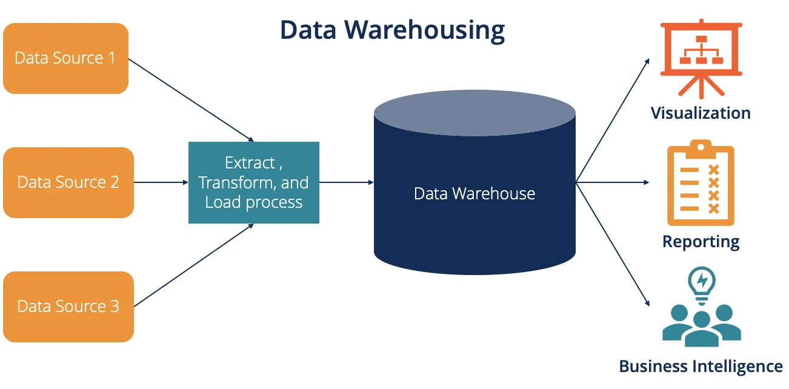
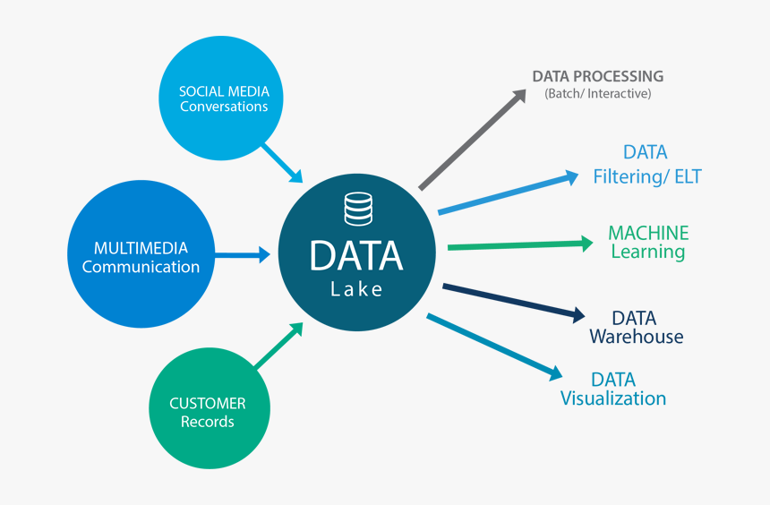

Title: Database & Data Warehouse & Data Lake
Date: 2022-04-02 21:00
Category: data engineering
Tags: data lake, data warehouse, database
Author: Andrey G
Status: published
Summary: defference between Database and Data Warehouse and Data Lake
Lang: en
---

[TOC]

I would like to have short summary here about these terms:

- Database – System which keep data to stack business tasks
- Warehouse – System which designed to provide data for analytics systems
- Data lake – Storage for all data. Everything will be stored here. for future generations 🙂

# Database

Stored your data to organize current business activity.

Technologies: MySQL, PostgreSQL, etc… Any relation or non relation databases.

# Warehouse

{: .image-process-article-image}

Special tipe of database. Can be organizer in similar technologies as Database layer.

It is historical storage which should answer on the business questions:

- how owten…
- how many…
- etc…

Technologies to analyze data: Amazon Redshift, Azure Synapse, PowerBI

A bit about terms

- DW or DWH – data warehouse
- EDW – enterprise data warehouse

# Data lake

{: .image-process-article-image}

You don’t know what you want, just keep data, maybe you will be able to analyze it in future and get some benefits from it. Nice approach, I like it 🙂

Technologies which we can use:

in AWS: Amazon S3, AWS Lake Formation

in Azure: Azure blob storage, Azure Data Lake

on Premise: Apache Hadoop, Ceph, PostgreSQL cluster, maybe MinIO, whatever what you can image. but be careful it is incredibly hard.

# Links

[https://azure.microsoft.com/en-us/solutions/data-lake/](https://azure.microsoft.com/en-us/solutions/data-lake/)

[https://aws.amazon.com/ru/products/storage/data-lake-storage/](https://aws.amazon.com/ru/products/storage/data-lake-storage/)

[https://hadoop.apache.org/](https://hadoop.apache.org/)

In this video below you can find very simple and clear description what it is and what the difference.

[https://www.youtube.com/watch?v=WgIbvkyY4mI](https://www.youtube.com/watch?v=WgIbvkyY4mI)
