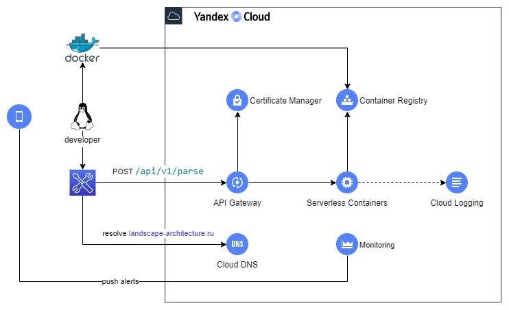

Title: plant-name-parser-service
Date: 2022-04-23 21:00
Category: SEED Project
Tags: antlr, spring boot, spring boot actuator, spring mvc, serverless, yandex cloud
Author: Andrey G
Status: published
Summary: Service to parse plant names
Lang: en
---

[TOC]

This is a rest application which accepts text and parse this text as plant name. Result will be returned as json structure with plant name parts.

## Source
[https://github.com/AGanyushkin/plant-name-parser-service](https://github.com/AGanyushkin/plant-name-parser-service)

## Interesting
It is Spring Boot application with parser which was implemented in ANTLR parser generator.

<br />
you can try this service as described in sample below
```
### Parse plant name request
POST https://landscape-architecture.ru/api/v1/parse
Content-Type: application/json

{
    "text": "Дуб черешчатый sel. Элсендорп"
}
```

<br />

## Serverless in Yandex Cloud
{: .image-process-big-article-image}

<br />

## Domain materials

[www.nrcs.usda.gov](http://www.nrcs.usda.gov)

[libanswers.nybg.org](http://libanswers.nybg.org)

[www.theplantlist.org](http://www.theplantlist.org)

[www.gardenersworld.com](http://www.gardenersworld.com)
