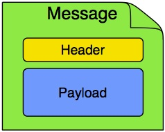

Title: Spring Integration
Date: 2022-02-05 21:00
Category: Spring
Tags: spring boot, spring integration
Author: Andrey G
Status: published
Summary: Spring Integration framework, concepts, basic overview
Lang: en
---

{: .image-process-article-image}

It is simple overview of Spring Integration component from Spring framework and it is impossible to cover all features in one article.

To illustrate how it works, I would like to build a simple demo application, link you can find below as usual.

Spring Integration provides ability to simple usage of “Enterprise Integration Patterns” in Spring application.

docs: [https://spring.io/projects/spring-integration](https://spring.io/projects/spring-integration)

about integration patterns: [https://www.enterpriseintegrationpatterns.com/](https://www.enterpriseintegrationpatterns.com/)

sample project: [https://github.com/AGanyushkin/demo-spring-integration](https://github.com/AGanyushkin/demo-spring-integration)

# For what?

For me, this overview it is something like summary to have more important information about Spring Integration in one place. This tool can be used both independently and together with Spring Batch to organize data pipelines. Also, Spring Integration provides simple way to separate computations between two or more servers.

# Configuration

First what we need to do it is configuration

```java
@Configuration
@EnableIntegration
public class IntegrationConfig {
  ...
```

we just need to enable Spring Integration and, if required, configure some datasources if they will be used in uor flows.

Also, here we will create our models for integration flows

```java
@NoArgsConstructor
@AllArgsConstructor
@Getter
@Builder
@ToString
public class Plant {
    private String plantId;
    private List<String> plantImages;
}

@NoArgsConstructor
@AllArgsConstructor
@Getter
@ToString
public class PlantRequest {
    private String plantId;
    private List<String> plantImages;
}
```

# Integration Flow

Time to create our first integration flow and it will be plant processing flow

```java
    @Bean
    public IntegrationFlow plantProcessingRequestFlow() {
        return IntegrationFlows
                .from(Http.inboundChannelAdapter("/plant")
                        .requestMapping(r -> r.methods(HttpMethod.POST))
                        .requestPayloadType(PlantRequest.class))
                .log()
                .filter((PlantRequest p) -> !p.getPlantId().isEmpty())
                .channel(inputRequests())
                .get();
    }
```

in this flow we are defining rest endpoint which will be created by Spring Integration and used as entry point to accept messages for this flow

Also here we have filter which drops all messages with empty plantId field.

And in final step message will be stored into inputRequests channel for next async flow

```java
    @Bean
    public IntegrationFlow plantProcessingFlow() {
        return IntegrationFlows
                .from(inputRequests())
                .<PlantRequest, Plant>transform(p -> Plant.builder()
                        .plantId(p.getPlantId())
                        .plantImages(p.getPlantImages())
                        .build())
                .handle(this.plantService, "savePlant")
                .handle(this.plantService, "markAsInProgress")
                .handle(this.imageService, "processImage")
                .handle(this.plantService, "processPlant")
                .handle(this.plantService, "markAsCompleted")
                .get();
    }
```

# Synchronous processing of rest requests

It is possible to create rest service with Spring Integration which will accept request, execute some processing with integration flow and return result as rest response

Implementation example for this case

```java
    @Bean
    public IntegrationFlow plantProcessingStatusFlow() {
        return IntegrationFlows
                .from(Http.inboundGateway("/plant/{plantId}")
                        .replyChannel("plantStatusReply")
                        .requestMapping(r -> r.methods(HttpMethod.GET))
                        .headerExpression("plantId", PARSER.parseExpression("#pathVariables.plantId")))
                .handle(this.plantService, "getProcessingStatus")
                .channel("plantStatusReply")
                .get();
    }
```

Here we declared endpoint which accepts request on “/plant/{plantId}” url, add path variable into message header and pass this message into service to do some processing. then service will return result, this result will be passed into `plantStatusReply` channel which declared as reply channel in `Http.inboundGateway` and this gateway will return reply as response.

# Messages and Channels

{: .image-process-article-image}

`Message` it is core concept in Spring Integration.

Spring integration provides different types of channels to cover all our needs.

more info here: [https://docs.spring.io/spring-integration/reference/html/channel.html](https://docs.spring.io/spring-integration/reference/html/channel.html)

# Filters

So simple to use filtering in Java DSL flow. Just define filter as lambda and pass it into `.filter` function as an argument

```java
@Bean
public IntegrationFlow plantProcessingStatusFlow() {
    return IntegrationFlows.from("channel-name")
             .filter((PlantRequest p) -> !p.getPlantId().isBlank())
             ...
```

# Input and output gateway

Rest endpoints to put messages into integration flow can be created by `Http.inboundGateway` or by `Http.inboundChannelAdapter` but to use flow directly from you service or you have some reasons to implement you own rest service you can use Gateway

```java
@MessagingGateway
public interface PlantProcessor {
    @Gateway(requestChannel="plants")
    void processPlant(Plant plant);
}
```

it is possible to have sync method call with response payload for this we need to configure `replyChannel` in `Gateway` annotaion:

```java
@Gateway(requestChannel="plants", replyChannel="processingResults")
```

# Service method execution

In Java DSL this is very simple process to call services and process data from flow

```java
@Bean
public IntegrationFlow plantProcessingStatusFlow() {
    return IntegrationFlows.from("channel-name")
             .handle(this.plantService, "getProcessingStatus")
             ...
```

as result, message or payload from integration flow will be processed in `this.plantService service in method getProcessingStatus` and returned result from this method will be passed to next step in flow

# Conclusion

Spring Integration in xml – it is terrible thing. Spring Integration with Java DSL – pretty simple to use and provides flexible features for developer.

It can definitely be used in data pipelines which should be written in in Java or with Spring Framework.
