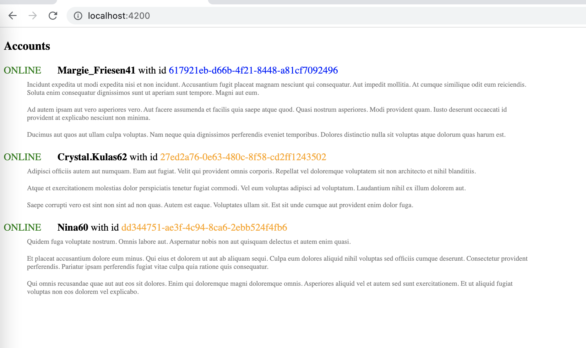

Title: Get data from multiple sources in Angular application
Date: 2022-09-05 00:01
Category: overview
Tags: Angular
Author: Andrey G
Status: published
---

{: .image-process-article-image}

# What I want to do?

Get data from three rest services and show these data in one view. All domain data relates which each other.

example application: [https://github.com/AGanyushkin/demo-angular-multiple-datasources](https://github.com/AGanyushkin/demo-angular-multiple-datasources)

fake api as data source for this demo: [spring-boot-and-nestjs](https://xn--80afqhoc8e3b.xn--p1ai/2022/09/04/spring-boot-and-nestjs/)

# Domain

##### Entities which will be used as data inside Angular application

```typescript
export interface Account {
  id: string
  fullName: string
  color: string
  status: string
  messages: Message[]
}

export interface Message {
    id: string
    text: string
}
```

##### Entities which will be used as response structure from rest endpoints

```typescript
export interface AccountResponse {
  id: string
  fullName: string
}

export interface AccountStatus {
  accountId: string
  status: string
}

export interface MessageResponse {
    id: string
    ownerId: string
    text: string
}
```

# What we would like to do?

load data from different sources A & B

Convert list of entities from A & B responses into internal entities

process data from A & B with different actions

merge data from A & B into single list G

load status data load from server for each entity from G list and add status into G[i] entity

filter G list, keep only entities with “ONLINE” status

for each entity in G list load from server messages for this entity

# Service implementation

In Angular we have ability to use RxJS, this library it is core components of Angular. With RxJS it can be implemented as below:

##### AccountService
```typescript
import {from, merge, Observable, switchMap, map, toArray, mergeMap, filter} from "rxjs";
...

@Injectable()
export class AccountService {
  constructor(private readonly httpClient: HttpClient) {
  }

  getListOfAccounts(): Observable<Account[]> {
    return merge(
      this.getListOfCustomers(),
      this.getListOfAdmins()
    )
      .pipe(
        this.loadOnlineStatus(),
        this.filterIfOnline(),
        this.loadMessages(),
        toArray(),
      )
  }
  ...
```

to get data from two endpoints for “customers” and “admins” accounts

##### AccountService
```typescript
  ...
  private getListOfCustomers(): Observable<Account> {
    return this.httpClient.get<AccountResponse[]>(environment.apiHost+'/account?size=7')
      .pipe(
        this.accountResponseToAccount(),
        this.injectColor('blue'),
      )
  }

  private getListOfAdmins(): Observable<Account> {
    return this.httpClient.get<AccountResponse[]>(environment.apiHost+'/account?size=3')
      .pipe(
        this.accountResponseToAccount(),
        this.injectColor('orange'),
      )
  }
  ...
```

pipe processing here seems like code duplication and of cause it can be implemented in different way in different situation. But let’s keep it as is to illustrate abilities which we have to process different sources in different ways.

To load account statuses

##### AccountService
```typescript
  private loadOnlineStatus() {
    return mergeMap((account: Account) =>
      this.httpClient.get<AccountStatus>(environment.apiHost+"/status?accountId="+account.id)
        .pipe(
          map((accountStatus: AccountStatus): Account => {
            account.status = accountStatus.status
            return account
          })
        )
    )
  }
```

RxJS can filter our stream in very simple one line of code

##### AccountService
```typescript
  private filterIfOnline() {
    return filter((account: Account) => account.status === 'ONLINE')
  }
```

As a last step we need to load messages for account from rest endpoint. let’s do it

##### AccountService
```typescript
  private loadMessages() {
    return mergeMap((account: Account) =>
      this.httpClient.get<MessageResponse[]>(environment.apiHost+"/message?size=3&ownerId="+account.id)
        .pipe(
          map((messages: MessageResponse[]): Account => {
            account.messages = messages
            return account
          })
        )
    )
  }
```

Let’s check the results:

{: .image-process-article-image}

There is only messages for “ONLINE” accounts. Blue id color – accounts from “customer” endpoint, orange colors it is admin accounts from different admin rest endpoint.

**NOTE**: of cause RxJS stream can be implemented without additional functions, but for me it seems more intuitive this approach to have processing as step by step or line by line definition in code.

**NOTE**: RxJS stream becomes very hard to read very quickly

# Conclusion

Approach with RxJS in Angular can be used some kind of alternative of Saga in React world. But complex RxJS streams can be uncomfortable to read 🙂

