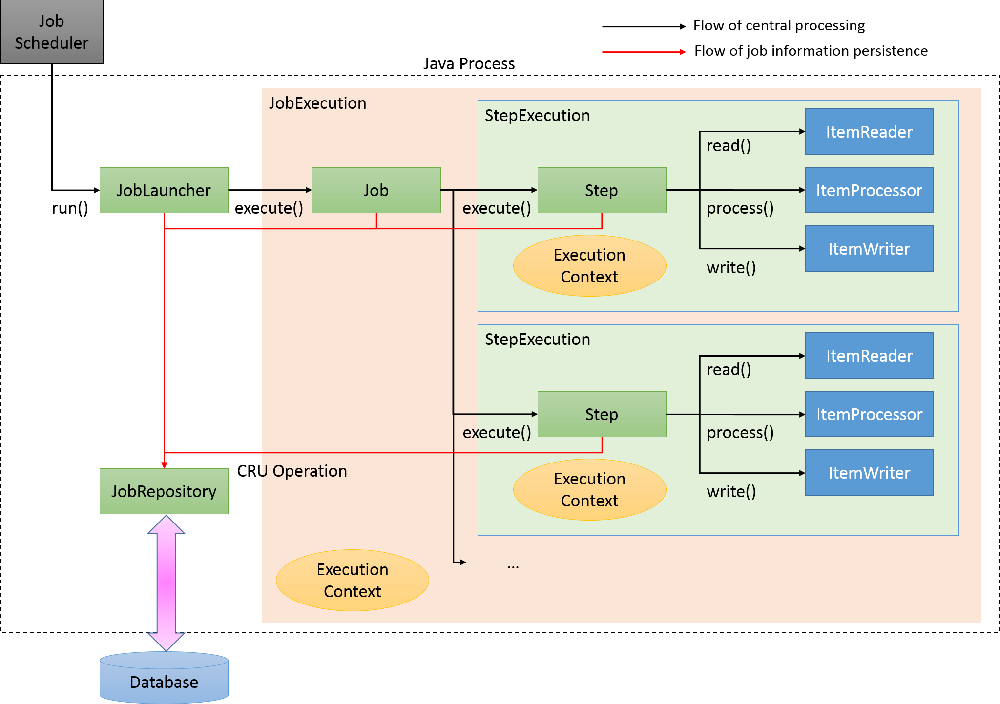

Title: Spring Batch as tool for ETL
Date: 2022-08-18 00:01
Category: data_pipeline
Tags: ETL, Spring Batch, Spring Boot
Author: Andrey G
Status: published
---

Spring Batch to do batch processing. Let’s process something in batches.

All code you can find here: [https://github.com/AGanyushkin/demo-springbatch](https://github.com/AGanyushkin/demo-springbatch)

A lot of interesting docs you can find here: [https://spring.io/projects/spring-batch](https://spring.io/projects/spring-batch).

# The Goal

For this overview I am going to implement very simple job to upload data snapshot from [arxiv.org](arxiv.org) to my local PostgreSQL database with primitive processing.

Snapshot can be downloaded from kaggle site: [https://www.kaggle.com/datasets/Cornell-University/arxiv?resource=download](https://www.kaggle.com/datasets/Cornell-University/arxiv?resource=download) it is single JSON file contains 1.7 million entries and has 3.48 GB size.

Each entry has fields like: id, title, doi, etc… I want to create table in database which will contain one row per each json entry with parsed field and with field which will contain all json as text.

# The main concepts of Spring Batch



**Step** – this is a smallest processed unit in Spring Batch. This element consists of ItemReader, ItemProcessor and ItemWriter which will get, process and store your data. In Spring Batch we can find some set of ItemReader’s and ItemWriter’s – [List of ItemReaders and ItemWriters](https://docs.spring.io/spring-batch/docs/current/reference/html/appendix.html#listOfReadersAndWriters)

**Job** – it is set of steps. All steps in the Job will be executed one by one by default or we can organize processing flow with sequential and/or parallel steps or combine what we need.

**JobLauncher** – responsible for launching of jobs. By default in Spring Batch we have sequential & synchronous job processing but if we need we can configure different launcher or replace default implementation

**JobRepository** – keep all processing metadata like jobs, statuses, steps, etc.. in database. If you don’t need any specific behaviour in this part it will be configured automatically.

# What we need to do to use Spring Batch

Let’s start with Spring Batch configuration and prepare ItemReader for our input data

```java
@Bean
@JobScope
public ItemReader<String> arxivSnapshorFileReader(
    @Value("#{jobParameters['filePath']}") String inputFilePath)
        throws MalformedURLException {
    var reader = new FlatFileItemReader<String>();
    reader.setResource(new FileUrlResource(inputFilePath));
    reader.setLineMapper(new PassThroughLineMapper());
    reader.open(new ExecutionContext());
    return reader;
}
```

this is a ItemReader which reads file and returns lines as items for processing without any pre-processing. filePath – it is field from JobParameters object which will be passed into JobLauncher.

```java
public class RawArxivEntryProcessor implements ItemProcessor<String, RawArxivEntry> {

    @Override
    public RawArxivEntry process(@NonNull String item) {
        try {
            var obj = new JSONObject(item);
            var doi = obj.getString("doi");
            if (doi == null || doi.equalsIgnoreCase("null")) {
                return null;
            }
            return RawArxivEntry.builder()
                    .doi(doi)
                    .textJson(item)
                    .build();
        } catch (Exception e) {
            log.error("Can't process item", e);
            return null;
        }
    }
}
```

ItemProcessor which will get only “doi” field from JSON and wrap it in entity.

If ItemProcessor returns null it means what current entity will be excluded from processing further.

In the code you can find other processor ArxivArticleEntryProcessor which transforms RawArxivEntry to ArxivArticleEntry.

```java
@Bean
public ItemWriter<RawArxivEntry> rawArxivEntryWriter(
        RawArxivEntryRepository snapshotArticleRepository) {
    var writer = new RepositoryItemWriter<RawArxivEntry>();
    writer.setRepository(snapshotArticleRepository);
    writer.setMethodName("save");
    return writer;
}
```

It is simple ItemWriter which will store all step output into table in database. snapshotArticleRepository – here it is just standard JPA repository.

When we have ItemReader, ItemProcessor and ItemWriter we can define the Step

```java
@Bean
public Step importerFromSnapshotFile(ItemReader<String> arxivSnapshorReader,
                                     ItemWriter<RawArxivEntry> rawArxivEntryWriter,
                                     RawArxivEntryProcessor snapshotItemProcessor) {
    return stepBuilderFactory
            .get("import file to raw entries")
            .<String, RawArxivEntry>chunk(13)
            .reader(arxivSnapshorReader)
            .processor(snapshotItemProcessor)
            .writer(rawArxivEntryWriter)
            .build();
}
```

very simple, just define all what we have.

`.get("import file to raw entries")` – it is a name for step

`.<String, RawArxivEntry>chunk(13)` – processing from String to RawArxivEntry with batch size 13

If we would like to run each entire Step in parallel in different threads we can define it like this

```java
@Bean
public TaskExecutor stepExecutor() {
    var taskExecutor = new SimpleAsyncTaskExecutor("step-");
    taskExecutor.setConcurrencyLimit(6);
    return taskExecutor;
}
...
          return stepBuilderFactory
                .get("generate arxiv articles from raw")
                .<RawArxivEntry, ArxivArticleEntry>chunk(100)
                .reader(rawArxivEntryReader)
                .processor(finalDataItemProcessor)
                .writer(ArxivArticleWriter)
                .taskExecutor(stepExecutor)
                .throttleLimit(4)
                .build();
...
```

`.throttleLimit(4)` – it is additional limit which applied over of thread pool limits, should be less then ConcurrencyLimit if you need this option.

Job definition – looks very simple if we are using simple step by step implementation

```java
@Bean
public Job arxivImporterJob(@Qualifier("importerFromSnapshotFile") Step step1,
                            @Qualifier("generateArxivArticles") Step step2) {
    return jobBuilderFactory.get("import data from arxiv snapshot")
            .start(step1)
            .next(step2)
            .build();
}
```

Finally, it is a good idea to have async launcher because default one will block execution till job will be done.

```java
private final JobRepository jobRepository;
...

@Bean
public TaskExecutor jobExecutor() {
    return new SimpleAsyncTaskExecutor("job-");
}

@Bean
public JobLauncher asyncJobLauncher(TaskExecutor jobExecutor) {
    var jobLauncher = new SimpleJobLauncher();
    jobLauncher.setJobRepository(jobRepository);
    jobLauncher.setTaskExecutor(jobExecutor);
    return jobLauncher;
}
```

Finally, we can create new

Define job parameters and start job programmatically:

```java
JobParametersBuilder builder = new JobParametersBuilder();
builder.addDate("timestamp", new Date());
builder.addString("filePath", inputFilePath);

var exception = asyncJobLauncher.run(arxivImporterJob, builder.toJobParameters());

log.info("batch job was started with jobId=" + exception.getJobId());
```

but, if in configuration you don’t have this one `spring.batch.job.enabled=false` then you jobs will be started automatically.

# What about testing

In Spring Batch we need only to implement item processor in separate class and configure all other assets. This approach makes testing of our new code very simple, we can use common approaches to testing for our bins:

```java
@SpringBootTest
class RawArxivEntryProcessorTest {
    @Autowired
    private RawArxivEntryProcessor processor;

    @Test
    public void shouldWork() throws Exception {
        var entry = processor.process(Utils.getSource(1));

        assertNotNull(entry);
        assertEquals(CONSTANTS.TEST_DATA_DOI, entry.getDoi());
    }

    @Test
    public void shouldReturnNullForIncorrectInput() throws Exception {
        var entry = processor.process(Utils.getSource(3));

        assertNull(entry);
    }
...
```

But, if you wont to have more complete test coverage for Spring Batch jobs – it is possible to test different parts of the batch processing algorithms.

Find more resources here: [sprint batch testing](https://docs.spring.io/spring-batch/docs/current/reference/html/testing.html)

# Results

A bit more then 1M entries was processed in two steps with following results:

```text
Job: [SimpleJob: [name=import data from arxiv snapshot]] launched with the following parameters: [{timestamp=1660858104845, filePath=T:/DATASETs/arxiv_dataset/arxiv-metadata-oai-snapshot.json}]

Executing step: [import file to raw entries]
Step: [import file to raw entries] executed in 5m45s587ms
Executing step: [generate arxiv articles from raw]
Step: [generate arxiv articles from raw] executed in 7m52s547ms

Job: [SimpleJob: [name=import data from arxiv snapshot]] completed with the following parameters: [{timestamp=1660858104845, filePath=T:/DATASETs/arxiv_dataset/arxiv-metadata-oai-snapshot.json}] and the following status: [COMPLETED] in 13m38s175ms
```

# Things that make me happy

Simple architecture and any processing flow can be implemented in simple way.

Big number predefined ItemReader & ItemWriter.

# The main difficulties

Hard to implement multithreading. Predefined FlatFileItemReader, JdbcCursorItemReader, etc… is not thread-safe. It makes to hard to process common data source with more than one thread.

RepositoryItemReader and other readers which uses pagination and sorting works very slow. And if we are going to process more than 1M items from DB – it take a lot of time. It can be mitigated with JdbcCursorItemReader but still in one thread.

Partitioning implements in not clear way with Spring Integration. As well as processing in two or more servers. It requires some strange configuration with SPring batch and Spring Integration.

# Conclusion

I will use it with all Spring Boot power to implement complex ETL tasks.
